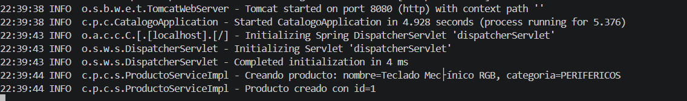
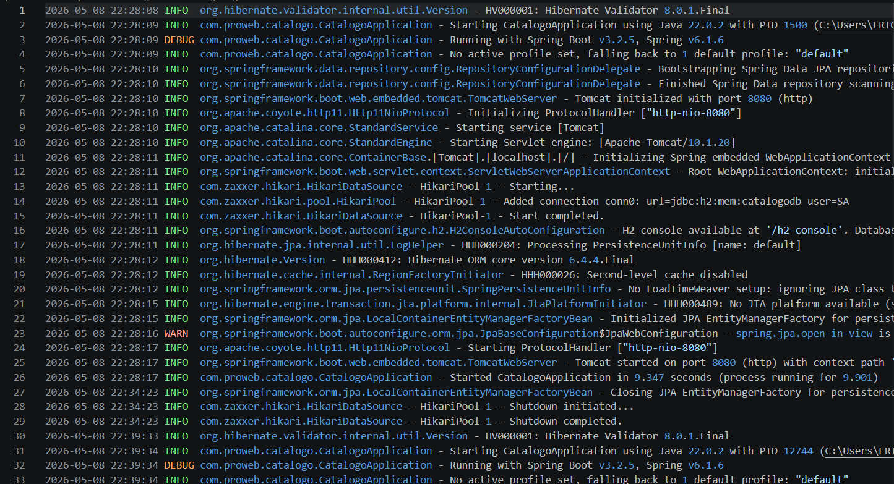
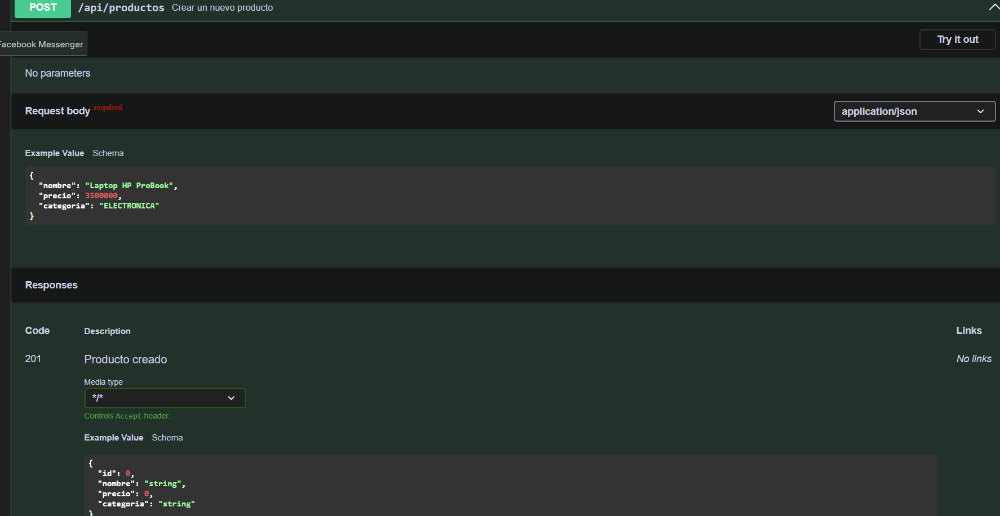

# Logging con SLF4J/Logback y Documentacion con Swagger/OpenAPI

## Autor

- **Nombre:** Jhoseth Esneider Rozo Carrillo
- **Codigo:** 02230131027
- **Programa:** Ingenieria de Sistemas
- **Unidad:** 11 Buenas Practicas y Patrones de Diseno
- **Actividad:** Post-Contenido 2
- **Fecha:** 2026

---

## Descripcion del Proyecto

Este proyecto extiende el laboratorio anterior de refactorizacion con SOLID, DAO/DTO y manejo global de excepciones.

La aplicacion integra:

- Logging profesional con SLF4J y Logback
- Documentacion interactiva con Swagger/OpenAPI
- Registro de eventos en consola y archivo
- Rotacion automatica de logs
- Documentacion completa de endpoints REST

La API permite gestionar productos y registrar todas las operaciones importantes utilizando niveles de log apropiados.

---

## Funcionalidades Implementadas

### Logging con SLF4J

- Logger estatico en la capa service
- Uso de niveles:
  - INFO
  - DEBUG
  - WARN
  - ERROR
- Uso de placeholders `{}` en lugar de concatenacion
- Registro de:
  - creacion de productos
  - busquedas
  - eliminaciones
  - errores y excepciones

### Configuracion de Logback

- Logs en consola
- Logs en archivo
- Rotacion diaria automatica
- Historial de 30 dias
- Formato personalizado

### Documentacion Swagger/OpenAPI

- Swagger UI interactivo
- Documentacion de endpoints
- Respuestas HTTP documentadas
- Parametros y ejemplos
- DTOs documentados con `@Schema`

---

## Tecnologias Utilizadas

- **Java 17**
- **Spring Boot 3.2.x**
- **Spring Web**
- **Spring Data JPA**
- **H2 Database**
- **Jakarta Validation**
- **SLF4J**
- **Logback**
- **springdoc-openapi 2.3.0**
- **Swagger UI**
- **Maven 3.9.x**
- **Postman**
- **IntelliJ IDEA / VS Code**

---

## Arquitectura del Proyecto

La aplicacion mantiene una arquitectura por capas aplicando principios SOLID y agregando logging y documentacion OpenAPI.

---

## Estructura del Proyecto

```text
src/main/java/com/empresa/catalogo/
├── controller/
│   └── ProductoController.java
│
├── service/
│   ├── ProductoService.java
│   └── ProductoServiceImpl.java
│
├── repository/
│   └── ProductoRepository.java
│
├── dto/
│   ├── ProductoRequestDTO.java
│   └── ProductoResponseDTO.java
│
├── entity/
│   └── Producto.java
│
├── factory/
│   └── ProductoFactory.java
│
├── exception/
│   ├── ApiError.java
│   ├── GlobalExceptionHandler.java
│   └── RecursoNoEncontradoException.java
│
└── CatalogoApplication.java

src/main/resources/
├── application.properties
└── logback-spring.xml

logs/
└── catalogo.log
```

---

## Diagrama de Arquitectura

```text
Cliente
   |
   v
Swagger UI
   |
   v
ProductoController
   |
   v
ProductoService
   |
   v
ProductoServiceImpl
   |
   +-------------------+
   |                   |
   v                   v
ProductoFactory   ProductoRepository
   |                   |
   v                   v
DTOs              Base de Datos H2

SLF4J + Logback
   |
   +--> Consola
   |
   +--> Archivo logs/catalogo.log
```

---

## Dependencia Swagger/OpenAPI

### pom.xml

```xml
<dependency>
    <groupId>org.springdoc</groupId>
    <artifactId>springdoc-openapi-starter-webmvc-ui</artifactId>
    <version>2.3.0</version>
</dependency>
```

---

## Configuracion application.properties

```properties
spring.application.name=catalogo

spring.h2.console.enabled=true
spring.datasource.url=jdbc:h2:mem:catalogodb
spring.datasource.driverClassName=org.h2.Driver
spring.datasource.username=sa
spring.datasource.password=

spring.jpa.hibernate.ddl-auto=update
spring.jpa.show-sql=true

server.port=8080

springdoc.api-docs.path=/api-docs
springdoc.swagger-ui.path=/swagger-ui.html
springdoc.swagger-ui.operationsSorter=method
```

---

## Configuracion Logback

Archivo:

```text
src/main/resources/logback-spring.xml
```

### Configuracion implementada

```xml
<configuration>

  <appender name="CONSOLA"
            class="ch.qos.logback.core.ConsoleAppender">

    <encoder>
      <pattern>
        %d{HH:mm:ss} %-5level %logger{30} - %msg%n
      </pattern>
    </encoder>

  </appender>

  <appender name="ARCHIVO"
            class="ch.qos.logback.core.rolling.RollingFileAppender">

    <file>logs/catalogo.log</file>

    <rollingPolicy
      class="ch.qos.logback.core.rolling.TimeBasedRollingPolicy">

      <fileNamePattern>
        logs/catalogo.%d{yyyy-MM-dd}.log
      </fileNamePattern>

      <maxHistory>30</maxHistory>

    </rollingPolicy>

    <encoder>
      <pattern>
        %d{yyyy-MM-dd HH:mm:ss} %-5level %logger - %msg%n
      </pattern>
    </encoder>

  </appender>

  <logger name="com.empresa.catalogo" level="DEBUG"/>

  <root level="INFO">
    <appender-ref ref="CONSOLA"/>
    <appender-ref ref="ARCHIVO"/>
  </root>

</configuration>
```

---

## Logging Implementado

### Logger SLF4J

```java
private static final Logger log =
    LoggerFactory.getLogger(ProductoServiceImpl.class);
```

### Ejemplo Crear Producto

```java
log.info(
    "Creando producto: nombre={}, categoria={}",
    dto.getNombre(),
    dto.getCategoria()
);
```

### Ejemplo Buscar Producto

```java
log.debug("Buscando producto con id={}", id);
```

### Ejemplo Advertencia

```java
log.warn("Producto con id={} no encontrado", id);
```

### Ejemplo Eliminacion

```java
log.info("Producto con id={} eliminado correctamente", id);
```

---

## Swagger/OpenAPI

### Configuracion Principal

```java
@OpenAPIDefinition(
    info = @Info(
        title = "API Catalogo de Productos",
        version = "1.0",
        description = "API REST para la gestion del catalogo de productos"
    )
)
@SpringBootApplication
public class CatalogoApplication {
}
```

---

## Documentacion de Endpoints

### Crear Producto

```java
@Operation(summary = "Crear un nuevo producto")

@ApiResponse(
    responseCode = "201",
    description = "Producto creado"
)

@ApiResponse(
    responseCode = "400",
    description = "Datos invalidos"
)
```

### Buscar Producto por ID

```java
@Operation(summary = "Obtener producto por ID")

@ApiResponse(
    responseCode = "200",
    description = "Producto encontrado"
)

@ApiResponse(
    responseCode = "404",
    description = "Producto no encontrado"
)
```

---

## DTO Documentado con @Schema

```java
@Schema(
    description = "Nombre del producto",
    example = "Laptop HP ProBook"
)
private String nombre;
```

```java
@Schema(
    description = "Precio en pesos colombianos",
    example = "3500000.00"
)
private Double precio;
```

```java
@Schema(
    description = "Categoria del producto",
    allowableValues = {
        "ELECTRONICA",
        "PAPELERIA",
        "HOGAR"
    },
    example = "ELECTRONICA"
)
private String categoria;
```

---

## Instrucciones de Ejecucion

### 1. Clonar repositorio

```bash
git clone https://github.com/usuario/apellido-post2-u11.git
```

### 2. Entrar al proyecto

```bash
cd apellido-post2-u11
```

### 3. Compilar proyecto

```bash
mvn compile
```

### 4. Ejecutar aplicacion

```bash
mvn spring-boot:run
```

La aplicacion iniciara en:

```text
http://localhost:8080
```

---

## Acceso Swagger UI

Abrir en navegador:

```text
http://localhost:8080/swagger-ui.html
```

Documentacion JSON OpenAPI:

```text
http://localhost:8080/api-docs
```

---

## Ubicacion de Archivos de Log

```text
logs/catalogo.log
```

Archivos rotados:

```text
logs/catalogo.2026-05-12.log
```

---

## Endpoints Implementados

### Crear Producto

```http
POST /api/productos
```

### Obtener Productos

```http
GET /api/productos
```

### Buscar Producto por ID

```http
GET /api/productos/{id}
```

### Eliminar Producto

```http
DELETE /api/productos/{id}
```

---

## CHECKPOINTS DE VERIFICACION

## Checkpoint 1 - SLF4J en el Servicio

### Verificaciones realizadas

- Logger configurado en `ProductoServiceImpl`
- Uso correcto de:
  - INFO
  - DEBUG
  - WARN
- Uso de placeholders `{}`

### Resultado esperado en consola

```text
[INFO] ProductoServiceImpl - Creando producto:
nombre=Laptop, categoria=ELECTRONICA
```

### Evidencia

```text
/evidencias/checkpoint1_logs_consola.png
```

---

## Checkpoint 2 - Archivo de Log

### Verificaciones realizadas

- Archivo `logs/catalogo.log` creado
- Logs almacenados correctamente
- Formato con fecha y hora completa
- Rotacion diaria configurada

### Ver contenido

```bash
cat logs/catalogo.log
```

### Evidencia

```text
/evidencias/checkpoint2_archivo_log.png
```

---

## Checkpoint 3 - Swagger UI

### Verificaciones realizadas

- Swagger UI accesible
- Grupo "Productos" visible
- Endpoints documentados
- Respuestas:
  - 200
  - 201
  - 400
  - 404

### URL

```text
http://localhost:8080/swagger-ui.html
```

### Evidencia

```text
/evidencias/checkpoint3_swagger_ui.png
```

---

## Capturas del Proyecto

Las capturas se encuentran en:

```text
/evidencias/
```

### Capturas Incluidas

- Logs en consola
- Archivo catalogo.log
- Swagger UI
- Endpoints documentados
- Respuestas HTTP
- Operaciones CRUD

---

## Convenciones Aplicadas

- Clases en PascalCase
- Variables y metodos en camelCase
- Logs descriptivos
- Logs con identificadores relevantes
- Uso de placeholders
- Swagger documentado en español
- DTOs con ejemplos reales
- Paquetes organizados por capas

---

## Commits Realizados

```text
feat: integrar SLF4J en capa service

feat: configurar logback con archivo y rotacion diaria

feat: agregar documentacion Swagger/OpenAPI

docs: agregar README y evidencias del proyecto
```

---

## Repositorio GitHub

```text
apellido-post2-u11
```

---

## Conclusiones

La integracion de SLF4J y Logback permite monitorear el comportamiento de la aplicacion mediante registros organizados y profesionales.

La configuracion de archivos de log facilita:

- auditoria
- monitoreo
- depuracion
- seguimiento de errores

La integracion de Swagger/OpenAPI mejora la documentacion de la API REST y facilita las pruebas de endpoints mediante una interfaz interactiva.

El proyecto mantiene una arquitectura limpia aplicando buenas practicas de desarrollo con Spring Boot.

---

## Capturas del Proyecto

Las capturas se encuentran en la carpeta `evidencias/`.

### Mensajes app corriendo



### Mensajes archivo logs



### Swagger UI


